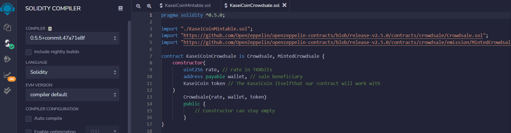
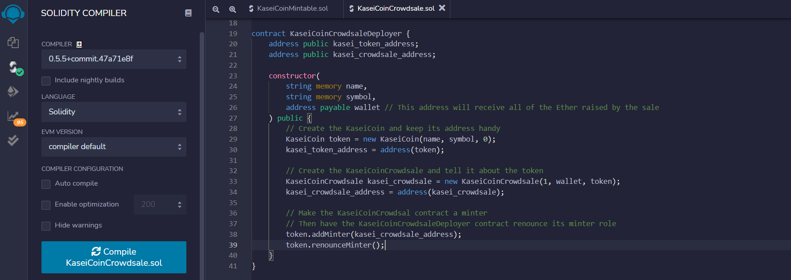
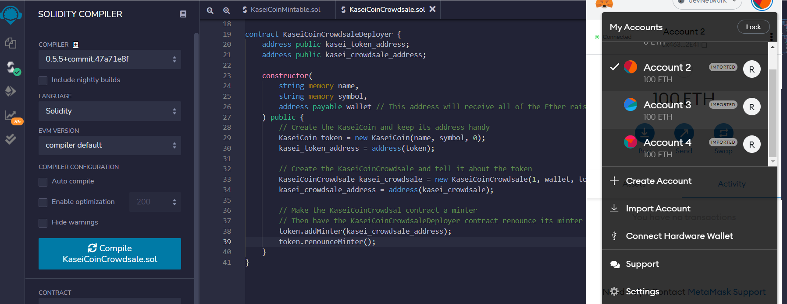
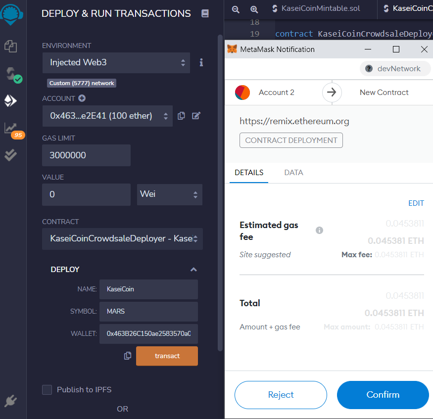
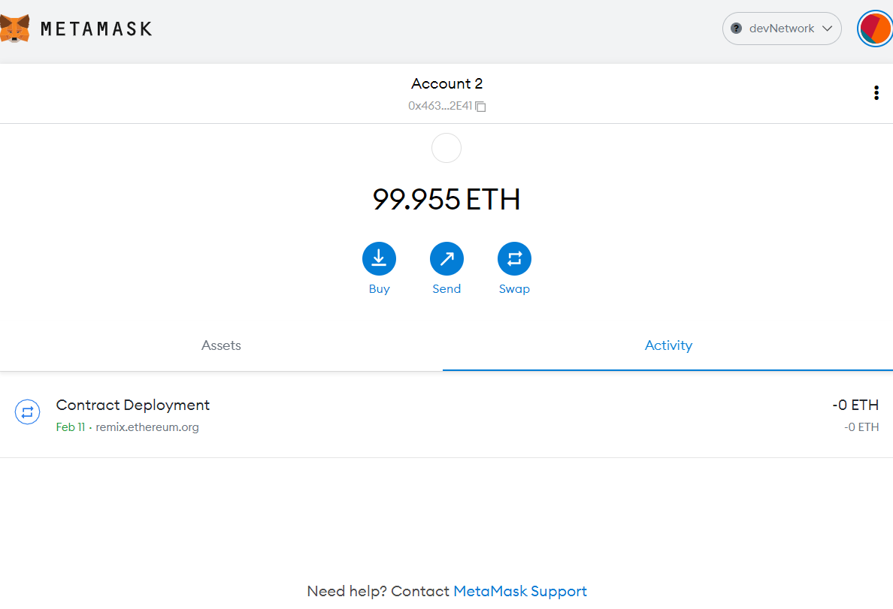
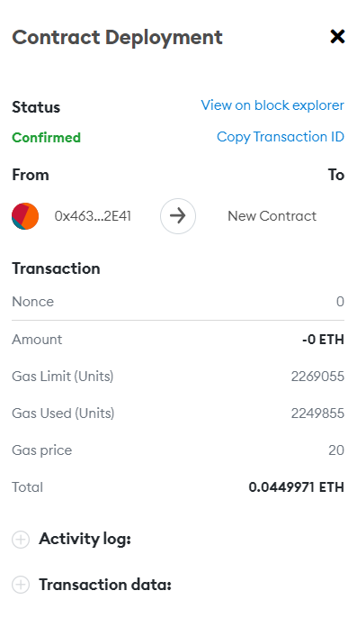
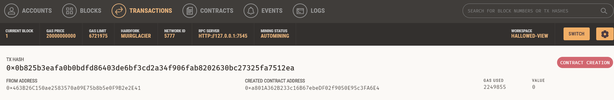

# KaseiCoin_Token_Crowdsale
Create a fungible token that is ERC-20 compliant and that will be minted by using a Crowdsale contract from the OpenZeppelin Solidity library.

---

## Technologies

This project leverages solidity 0.5.0 with the following packages:

**[OpenZeppelin IERC20 Interface](https://github.com/OpenZeppelin/openzeppelin-contracts/blob/release-v2.5.0/contracts/token/ERC20/ERC20.sol)** - Implementation of the {IERC20} interface.

**[OpenZeppelin ERC20 Detailed](https://github.com/OpenZeppelin/openzeppelin-contracts/blob/release-v2.5.0/contracts/token/ERC20/ERC20Detailed.sol)** - Optional functions from the ERC20 standard

**[OpenZeppelin ERC20 Mintable](https://github.com/OpenZeppelin/openzeppelin-contracts/blob/release-v2.5.0/contracts/token/ERC20/ERC20Mintable.sol)** - Extension of {ERC20} that adds a set of accounts with the {MinterRole}, which have permission to mint (create) new tokens as they see fit

**[OpenZeppelin Crowdsale Contract](https://github.com/OpenZeppelin/openzeppelin-contracts/blob/release-v2.5.0/contracts/crowdsale/Crowdsale.sol)** - Crowdsale is a base contract for managing a token crowdsale, allowing investors to purchase tokens with ether. This contract implements such functionality in its most fundamental form and can be extended to provide additional functionality and/or custom behavior

**[OpenZeppelin Minted Crowdsale Contract](https://github.com/OpenZeppelin/openzeppelin-contracts/blob/release-v2.5.0/contracts/crowdsale/emission/MintedCrowdsale.sol)** - Extension of Crowdsale contract whose tokens are minted in each purchase. Token ownership should be transferred to MintedCrowdsale for minting

---

## Installation Guide

There are 2 applications that should be downloaded to work with this program:

1. Ganache

**[Ganache Test BlockChain](https://trufflesuite.com/ganache/)** - Follow the installation instructions for your Operating System. 

2. Metamask

**[Metamask Digital Wallet](https://metamask.io/)** - Follow the installation instructions for your Operating System.

---

## Usage

To use the 'KaseiCoin Token Crowdsale' application, simply clone the repository and import the code in both the `KaseiCoinMintable.sol` and `KaseiCoinCrowdsale.sol` files into the Remix IDE. 

Step 1: Compile the `KaseiCoin` contract

The green checkmark we see by the Solidity `S` lets us know that we compiled this contract successfully. 

Step 2: Compile the `KaseiCoinCrowdsale` contract

Once again, the green checkmark we see by the Solidity `S` lets us know that we compiled this contract successfully.

Step 3: Compile the `KaseiCoinCrowdsaleDeployer` contact

Finally, the green checkmark we see by the Solidity `S` lets us know that we compiled this contract successfully.

Great! We have successfully compiled all 3 contracts for our new token.

Step 4: Connect to MetaMask

The preceding image shows us that we are connected to Metamask and we have 4 active accounts. 
These accounts were imported from Ganache. 

Step 5: Deploy the `KaseiCoinCrowdsaleDeployer` contract

We can see from the above image that Remix is asking MetaMask for confirmation of the deployment. This lets us know that Remix, Ganache, and MetaMask are all working as expected. 
Once we click `Confirm`, the `KaseiCoinCrowdsaleDeployer` contract will be deployed. 

Step 6: `KaseiCoinCrowdsaleDeployer` contract deployment verification

From the sidebar, pick the correct contract, in this case the `KaseiCoinCrowdsaleDeployer` contract. Click on the arrow for the `Deploy` function, name the token `KaseiCoin`, give it a symbol of `MARS`, and select the wallet that will be the beneficiary (owner) of this contract. Click `transact`, and once it is confirmed through Metamask, you'll see the confirmation like the one from the image above. 

Step 7: MetaMask Deployment

In the image, we can see that `Account 2` in MetaMask dployed the contract through Remix on February 11. 

Step 8: MetaMask Deployment Confirmation

We can see that the account ending in `...E41` is the `msg.sender`. In other words, we have confirmed that `Account 2` deployed the contract successfully. 

Step 9: Deployment to Ganache

We can verify through Ganache that the contract was executed. There is a red display on the right-hand side that says `Contract Creation`. This, along with the transaction hash, which is prominently displayed, give us our contract creation confirmation. 

Awesome! We have compiled and successfully deployed our `KaseiCoinCrowdsaleDeployer` contract. Now we will use this contract to deploy the 2 remaining contracts. 

Step 10: `KaseiCoinCrowdsale` contract deployment

TO deploy the `KaseiCoinCrowdsale` contract, we make sure we select the right contract from the dropdown list. In this case, we need to select `KaseiCoinCrowdsale - KaseiCoinCrowdsale.sol`. Then, from the `KaseiCoinCrowdsaleDeployer` contract functions, click on the `kasei_crowdsale_address` button. Copy the address that is returned. Then, just below the `Deploy` button, you will see a `At Address` button, followed by an input field. Make sure you paste the copied `kasei_crowdsale_address` and click the button. This will deploy the `KaseiCoinCrowdsale` contract.

