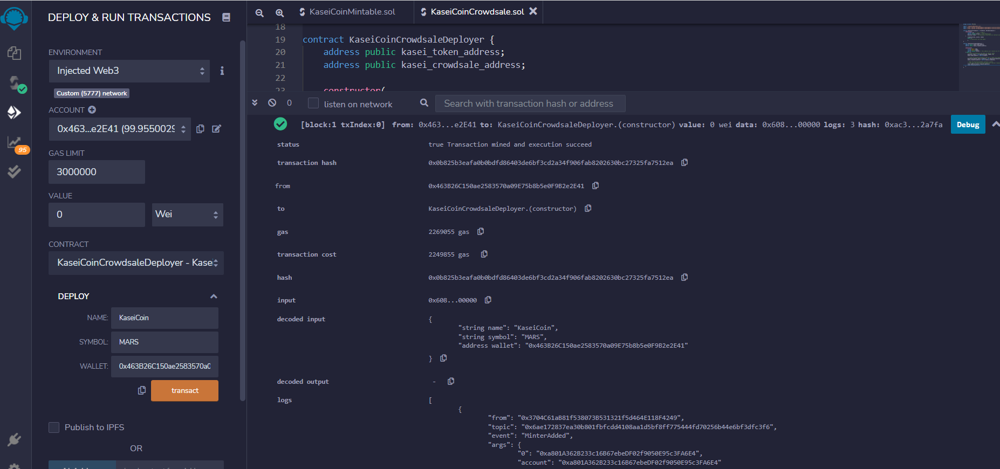
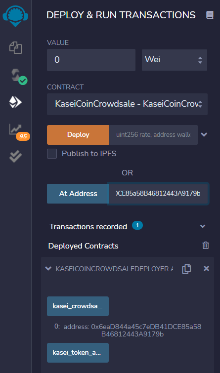
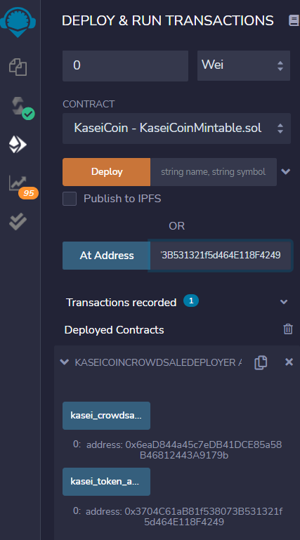
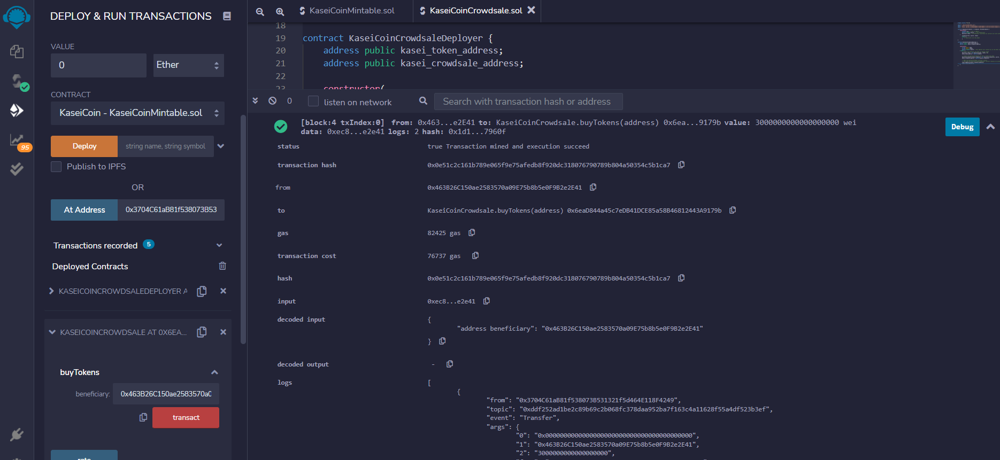

# KaseiCoin_Token_Crowdsale
Create a fungible token that is ERC-20 compliant and that will be minted by using a Crowdsale contract from the OpenZeppelin Solidity library.

---

## Technologies

This project leverages solidity 0.5.0 with the following packages:

**[OpenZeppelin IERC20 Interface](https://github.com/OpenZeppelin/openzeppelin-contracts/blob/release-v2.5.0/contracts/token/ERC20/ERC20.sol)** - Implementation of the {IERC20} interface.

**[OpenZeppelin ERC20 Detailed](https://github.com/OpenZeppelin/openzeppelin-contracts/blob/release-v2.5.0/contracts/token/ERC20/ERC20Detailed.sol)** - Optional functions from the ERC20 standard

**[OpenZeppelin ERC20 Mintable](https://github.com/OpenZeppelin/openzeppelin-contracts/blob/release-v2.5.0/contracts/token/ERC20/ERC20Mintable.sol)** - Extension of {ERC20} that adds a set of accounts with the {MinterRole}, which have permission to mint (create) new tokens as they see fit

**[OpenZeppelin Crowdsale Contract](https://github.com/OpenZeppelin/openzeppelin-contracts/blob/release-v2.5.0/contracts/crowdsale/Crowdsale.sol)** - Crowdsale is a base contract for managing a token crowdsale, allowing investors to purchase tokens with ether. This contract implements such functionality in its most fundamental form and can be extended to provide additional functionality and/or custom behavior

**[OpenZeppelin Minted Crowdsale Contract](https://github.com/OpenZeppelin/openzeppelin-contracts/blob/release-v2.5.0/contracts/crowdsale/emission/MintedCrowdsale.sol)** - Extension of Crowdsale contract whose tokens are minted in each purchase. Token ownership should be transferred to MintedCrowdsale for minting

---

## Installation Guide

There are 2 applications that should be downloaded to work with this program:

1. Ganache

**[Ganache Test BlockChain](https://trufflesuite.com/ganache/)** - Follow the installation instructions for your Operating System. 

2. Metamask

**[Metamask Digital Wallet](https://metamask.io/)** - Follow the installation instructions for your Operating System.

---

## Usage

To use the 'KaseiCoin Token Crowdsale' application, simply clone the repository and import the code in both the `KaseiCoinMintable.sol` and `KaseiCoinCrowdsale.sol` files into the Remix IDE. 

Step 1: Compile the `KaseiCoin` Contract

The green checkmark we see by the Solidity `S` lets us know that we compiled this contract successfully. 

Step 2: Compile the `KaseiCoinCrowdsale` Contract

Once again, the green checkmark we see by the Solidity `S` lets us know that we compiled this contract successfully.

Step 3: Compile the `KaseiCoinCrowdsaleDeployer` Contact

Finally, the green checkmark we see by the Solidity `S` lets us know that we compiled this contract successfully.

Great! We have successfully compiled all 3 contracts for our new token.

Step 4: Connect to MetaMask

The preceding image shows us that we are connected to Metamask and we have 4 active accounts. 
These accounts were imported from Ganache. 

Step 5: Deploy the `KaseiCoinCrowdsaleDeployer` contract

We can see from the above image that Remix is asking MetaMask for confirmation of the deployment. This lets us know that Remix, Ganache, and MetaMask are all working as expected. 
Once we click `Confirm`, the `KaseiCoinCrowdsaleDeployer` contract will be deployed. 

Step 6: `KaseiCoinCrowdsaleDeployer` contract deployment verification

From the sidebar, pick the correct contract, in this case the `KaseiCoinCrowdsaleDeployer` contract. Click on the arrow for the `Deploy` function, name the token `KaseiCoin`, give it a symbol of `MARS`, and select the wallet that will be the beneficiary (owner) of this contract. Click `transact`, and once it is confirmed through Metamask, you'll see the confirmation like the one from the image above. 

Step 7: MetaMask Deployment

In the image, we can see that `Account 2` in MetaMask dployed the contract through Remix on February 11. 

Step 8: MetaMask Deployment Confirmation

We can see that the account ending in `...E41` is the `msg.sender`. In other words, we have confirmed that `Account 2` deployed the contract successfully. 

Step 9: Deployment to Ganache

We can verify through Ganache that the contract was executed. There is a red display on the right-hand side that says `Contract Creation`. This, along with the transaction hash, which is prominently displayed, give us our contract creation confirmation. 

Awesome! We have compiled and successfully deployed our `KaseiCoinCrowdsaleDeployer` contract. Now we will use this contract to deploy the 2 remaining contracts. 

Step 10: `KaseiCoinCrowdsale` contract deployment

To deploy the `KaseiCoinCrowdsale` contract, we make sure we select the right contract from the dropdown list. In this case, we need to select `KaseiCoinCrowdsale - KaseiCoinCrowdsale.sol`. Then, from the `KaseiCoinCrowdsaleDeployer` contract functions, click on the `kasei_crowdsale_address` button. Copy the address that is returned. Then, just below the `Deploy` button, you will see a `At Address` button, followed by an input field. Make sure you paste the copied `kasei_crowdsale_address` and click the button. This will deploy the `KaseiCoinCrowdsale` contract.

Step 11: `KaseiCoinCrowdsale` contract functions

Once the `KaseiCoinCrowdsale` is deployed successfully, we can verify it by viewing its available functions. If no functions show up, we can determine that the contract did not deploy correctly. 
We can see several avilable functions in this contract. We can use the `buyTokens`, `rate`, `token`, `wallet`, and `weiRaised` functions. The `weiRaised` function is extremely important for this Crowdsale, as it displays the amount of wei we have raised with the sell of our token. 

Step 12: `KaseiCoin` Contract Deployment

To deploy the `KaseiCoin` contract, we make sure we select the right contract from the dropdown list. In this case, we need to select `KaseiCoin - KaseiCoinMintable.sol`. Then, from the `KaseiCoinCrowdsaleDeployer` contract functions, click on the `kasei_token_address` button. Copy the address that is returned. Then, just below the `Deploy` button, you will see a `At Address` button, followed by an input field. Make sure you paste the copied `kasei_token_address` and click the button. This will deploy the `KaseiCoin` contract.

Step 13: `KaseiCoin` Contract Functions

Once the `KaseiCoin` is deployed successfully, we can verify it by viewing its available functions. If no functions show up, we can determine that the contract did not deploy correctly. 
We can see several avilable functions in this contract. We can use the `addMinter`, `approve`, `decreaseAllowance`, `increaseAllowance`, and ending with the `totalSupply` function. The `totalSupply` function is extremely important for this `KaseiCoin` contract, as it displays the amount of `MARS` tokens we have minted at any point of the contract. 

Step 14: `Account 3` Buy 1 Ether in `MARS` Tokens

We are now assuming the role of investors in the Crowdsale. 
If we are the owner of `Account 3`, we would make sure we were interacting with the functions of the `KaseiCoinCrowdsale` contract. Find the `buyTokens` function. In the input field provided, enter your account address. Once you click the `buyTokens` button, MetaMask will ask you to confirm the transaction, and you should then be able to verify your balances in Remix, MetaMask, and Ganache. Make sure you enter a value in the input field named `VALUE`. It is located right above the contract drop-down menu. For this example, `Account 3` is purchasing 1 Ether, or 1,000,000,000,000,000,000 wei. Due to our rate of 1, `Account 3` will then receive an equal number of tokens to the amount of wei the account sends the contract. 

Step 15: Purchase Confirmation After `Account 3` Purchase

We can see in the `terminal` view the confirmation of the transaction. It returns a green check mark with a status of `"true Transaction mined and execution succed"`. It also provides important information such as the transaction hash, the account beneficiary, as well as a verification of the amount of tokens purchased, in wei. 

Step 16: MetaMask Purchase Confirmation

Here is another way to verify the latest transaction. `Account 3` ending in `...5cDA` purchased 1 ETH worth of `MARS`. It called the contract address, ending in `...179b`, to accomplish this transaction. Once the gas fees have been added, the total amount of ETH is displayed. The status of the transaction also lets us know it has been `Confirmed`. 

Step 17: Ganache Purchase Confirmation

Finally, one more way of validating that our transaction was successful. Navigate to Ganache and click the `TRANSACTIONS` tab. You will now see both transactions the contract has generated. The first was our `Contract Creation`, or deployment. Now, we can see the second transaction with a blue label reading `Contract Call`. This is where `Account 3` is purchasing 1 ETH worth of `MARS` tokens. Ganache also provides us the transaction hash, as well as the `msg.sender` and contract addresses. 

Step 18: `Account 3` Balance

Make sure that you are interacting with the correct contract. You should click the arrow just to the left of the `KaseiCoin` contract. This will display all of the functions available to us. Scroll until you see the function `balanceOf`. We need to type the `Account 3` address, ending in `...5cDA`, and then press the blue `call` button. This will display the current balance, in tokens, for `Account 3`.

Step 19: `Account 3` Balance Confirmation

Once we click the `call` button, there are two ways to verify our balance in Remix. First, the sidebar will display the balance, in tokens, the account owns. Right below the `call` button of the `balanceOf` function, we can see that the account has a balance of 1,000,000,000,000,000,000, in wei, worth of MARS tokens.
There is also the `terminal` view in Remix. In the terminal, the very first thing we see at the top is "call to KaseiCoin.balanceOf". This lets us know that this function was called. The execution log follows. Notice the input matches the last 4 digits of `Account 3`. Finally, the decoded output is the balance, in wei, of tokens, and the transaction hash is also provided. We can see that both the balance in the sidebar and in the terminal match, so we have viewed the account's balance. 

Step 20: Import Tokens to `Account 3`

When we are ready to import our tokens to our MetaMask wallet, we need to click on `Import Tokens` in MetaMask, in the input field labeled `Token Contract Address` enter the token address, ending in `...4249`. The Token Symbol `MARS`, and the Token Decimal (18), as well. Once the current information is automatically filled in, click on the blue button, `Add Custom Token`, and our tokens will be sent into our MetaMask wallet for storage. 

Step 21: `Address 3` Token Import Confirmation

If we navigate back to MetaMask, we can now see in the `Assets` tab, for `Account 3`, we now have 1 `MARS` token. That is in addition to 98.9979 ETH. 

Congratulations! You have now purchased and transferred a `MARS` token to your MetaMask wallet. 

Step 22: Token Total Supply After First Purchase

Once again, there are two main ways for us to verify the total supply of `MARS` tokens minted. First, in the Remix sidebar, navigate to the `KaseiCoin` contract and click on it to view its functions. Scroll until you see the last function called `totalSupply`. Once you click on the button, you should see the total amount of minted tokens. In this case, since `Account 3` purchased 1 ETH worth of tokens, we have a `totalSupply` of 1,000,000,000,000,000,000 tokens after the first purchase. The other way to verify would be through the `terminal` view of Remix. Here we can see at the top that a call was made to `KaseiCoin.totalSupply`. It displays who the `msg.sender` is and the contract address, the hash for this contract call, and finally the `decoded output` displays the same `totalSupply` as we saw in the sidebar. 

Step 23: Wei Raised After First Purchase

Finally, we can view the amount of wei raised from the Crowdsale. In order to do so, navigate to the `KaseiCoinCrowdsale` contract tab, under `Deployed Contracts`, to display its functions. Scroll to the last function, `weiRaised`, and click the button. This example displays a `weiRaised` value of 1,000,000,000,000,000,000, right under the `weiRaised` button. This makes sense considering we are exchanging 1 wei for 1 token, that being our `rate`. Like with other functions, we can also validate the transaction via the `terminal`. The very first line we see states `"call to KaseiCoinCrowdsale.weiRaised"`. It provides the `msg.sender` and contract addresses, as well as the hash for this call. We can see the `decoded output` is exactly what we expected, and matches the amount we saw in the sidebar. 

Great! We have now deployed our 3 contracts, connected Ganache, Remix, and MetaMask, and processed a purchase transaction. We were also able to see our confirmations via Ganache and MetaMask. Most importantly, we were able to see how many tokens have been minted, and how much money, in wei, we have raised from our Crowdsale.

We will complete 2 more transactions to really test the `totalSupply` and `weiRaised` functions.

Step 24: `Account 4` Buy 2 Ether in `MARS` Tokens

If we are the owner of `Account 4`, we would make sure we were interacting with the functions of the `KaseiCoinCrowdsale` contract. Find the `buyTokens` function. In the input field provided, enter your account address. Once you click the `buyTokens` button, MetaMask will ask you to confirm the transaction, and you should then be able to verify your balances in Remix, MetaMask, and Ganache. Make sure you enter a value in the input field named `VALUE`. It is located right above the contract drop-down menu. For this example, `Account 4` is purchasing 2 Ether, or 2,000,000,000,000,000,000 wei. Due to our rate of 1, `Account 4` will then receive an equal number of tokens to the amount of wei the account sends the contract.

Step 25: Purchase Confirmation After `Account 4` Purchase

We can see in the `terminal` view the confirmation of the transaction. It returns a green check mark with a status of `"true Transaction mined and execution succed"`. It also provides important information such as the transaction hash, the address beneficiary, as well as a verification of the amount of tokens purchased, in wei.

Step 26: MetaMask Purchase Confirmation

Here is another way to verify the latest transaction. `Account 4` ending in `...3c43` purchased 2 ETH worth of `MARS`. It called the contract address, ending in `...179b`, to accomplish this transaction. Once the gas fees have been added, the total amount of ETH is displayed. The status of the transaction also lets us know it has been `Confirmed`.

Step 27: Ganache Purchase Confirmation

Finally, one more way of validating that our transaction was successful. Navigate to Ganache and click the `TRANSACTIONS` tab. You will now see all transactions the contract has generated. The first was our `Contract Creation`, or deployment. Now, we can see the second transaction with a blue label reading `Contract Call`. This is where `Account 3` is purchasing 1 ETH worth of `MARS` tokens. The third transaction has a blue label reading `Contract Call`. This is where `Account 4` is purchasing 2 ETH worth of `MARS` tokens. Ganache also provides us the transaction hash, as well as the `msg.sender` and contract addresses.

Step 28: `Account 4` Balance

Make sure that you are interacting with the correct contract. You should click the arrow just to the left of the `KaseiCoin` contract. This will display all of the functions available to us. Scroll until you see the function `balanceOf`. We need to type the `Account 4` address, ending in `...3c43`, and then press the blue `call` button. This will display the current balance, in tokens, for `Account 4`.

Step 29: `Account 4` Balance Confirmation

Once we click the `call` button, there are two ways to verify our balance in Remix. First, the sidebar will display the balance, in tokens, the account owns. Right below the `call` button of the `balanceOf` function, we can see that the account has a balance of 2,000,000,000,000,000,000, in wei, worth of MARS tokens.
There is also the `terminal` view in Remix. In the terminal, the very first thing we see at the top is "call to KaseiCoin.balanceOf". This lets us know that this function was called. The execution log follows. Notice the input matches the last 4 digits of `Account 4`. Finally, the decoded output is the balance, in wei, of tokens, and the transaction hash is also provided. We can see that both the balance in the sidebar and in the terminal match, so we have viewed the account's balance. 

Step 30: Import Tokens to `Account 4`

When we are ready to import our tokens to our MetaMask wallet, we need to click on `Import Tokens` in MetaMask, in the input field labeled `Token Contract Address` enter the token address, ending in `...4249`. The Token Symbol `MARS`, and the Token Decimal (18), as well. Once the current information is automatically filled in, click on the blue button, `Add Custom Token`, and our tokens will be sent into our MetaMask wallet for storage. 

Step 31: `Address 4` Token Import Confirmation

If we navigate back to MetaMask, we can now see in the `Assets` tab, for `Account 4`, we now have 2 `MARS` tokens. That is in addition to 97.9985 ETH.

Step 32: Token Total Supply After Second Purchase

Once again, there are two main ways for us to verify the total supply of `MARS` tokens minted. First, in the Remix sidebar, navigate to the `KaseiCoin` contract and click on it to view its functions. Scroll until you see the last function called `totalSupply`. Once you click on the button, you should see the total amount of minted tokens. In this case, since `Account 3` purchased 1 ETH worth of tokens, and `Account 4` purchased 2 ETH worth of tokens, we have a `totalSupply` of 3,000,000,000,000,000,000 tokens after both purchases. The other way to verify would be through the `terminal` view of Remix. Here we can see at the top that a call was made to `KaseiCoin.totalSupply`. It displays who the `msg.sender` is and the contract address, the hash for this contract call, and finally the `decoded output` displays the same `totalSupply` as we saw in the sidebar.

Step 33: Wei Raised After Second Purchase

Finally, we can view the amount of wei raised from the Crowdsale. In order to do so, navigate to the `KaseiCoinCrowdsale` contract tab, under `Deployed Contracts`, to display its functions. Scroll to the last function, `weiRaised`, and click the button. This example displays a `weiRaised` value of 3,000,000,000,000,000,000, right under the `weiRaised` button. This makes sense considering we are exchanging 1 wei for 1 token, that being our `rate`. Like with other functions, we can also validate the transaction via the `terminal`. The very first line we see states `"call to KaseiCoinCrowdsale.weiRaised"`. It provides the `msg.sender` and contract addresses, as well as the hash for this call. We can see the `decoded output` is exactly what we expected, and matches the amount we saw in the sidebar. 

Now, for our third and final transaction.

Step 34: `Account 2` Buy 3 Ether in `MARS` Tokens

If we are the owner of `Account 2`, we would make sure we were interacting with the functions of the `KaseiCoinCrowdsale` contract. Find the `buyTokens` function. In the input field provided, enter your account address. Once you click the `buyTokens` button, MetaMask will ask you to confirm the transaction, and you should then be able to verify your balances in Remix, MetaMask, and Ganache. Make sure you enter a value in the input field named `VALUE`. It is located right above the contract drop-down menu. For this example, `Account 2` is purchasing 3 Ether, or 3,000,000,000,000,000,000 wei. Due to our rate of 1, `Account 2` will then receive an equal number of tokens to the amount of wei the account sends the contract.

Step 35: Purchase Confirmation After `Account 2` Purchase

We can see in the `terminal` view the confirmation of the transaction. It returns a green check mark with a status of `"true Transaction mined and execution succed"`. It also provides important information such as the transaction hash, the address beneficiary, as well as a verification of the amount of tokens purchased, in wei.

Step 36: MetaMask Purchase Confirmation

Here is another way to verify the latest transaction. `Account 2` ending in `...2E41` purchased 3 ETH worth of `MARS`. It called the contract address, ending in `...179b`, to accomplish this transaction. Once the gas fees have been added, the total amount of ETH is displayed. The status of the transaction also lets us know it has been `Confirmed`.

Step 37: Ganache Purchase Confirmation

Finally, one more way of validating that our transaction was successful. Navigate to Ganache and click the `TRANSACTIONS` tab. You will now see all transactions the contract has generated. The first was our `Contract Creation`, or deployment. Now, we can see the second transaction with a blue label reading `Contract Call`. This is where `Account 3` is purchasing 1 ETH worth of `MARS` tokens. The third transaction has a blue label reading `Contract Call`. This is where `Account 4` is purchasing 2 ETH worth of `MARS` tokens. The fourth, and final, transaction has a blue label reading `Contract Call`. This is where `Account 2` is purchasing 3 ETH worth of `MARS` tokens. Ganache also provides us the transaction hash, as well as the `msg.sender` and contract addresses.

Step 38: `Account 2` Balance

Make sure that you are interacting with the correct contract. You should click the arrow just to the left of the `KaseiCoin` contract. This will display all of the functions available to us. Scroll until you see the function `balanceOf`. We need to type the `Account 2` address, ending in `...2E41`, and then press the blue `call` button. This will display the current balance, in tokens, for `Account 2`.

Step 39: `Account 2` Balance Confirmation

Once we click the `call` button, there are two ways to verify our balance in Remix. First, the sidebar will display the balance, in tokens, the account owns. Right below the `call` button of the `balanceOf` function, we can see that the account has a balance of 3,000,000,000,000,000,000, in wei, worth of MARS tokens.
There is also the `terminal` view in Remix. In the terminal, the very first thing we see at the top is "call to KaseiCoin.balanceOf". This lets us know that this function was called. The execution log follows. Notice the input matches the last 4 digits of `Account 2`. Finally, the decoded output is the balance, in wei, of tokens, and the transaction hash is also provided. We can see that both the balance in the sidebar and in the terminal match, so we have viewed the account's balance.

Step 40: Import Tokens to `Account 2`

When we are ready to import our tokens to our MetaMask wallet, we need to click on `Import Tokens` in MetaMask, in the input field labeled `Token Contract Address` enter the token address, ending in `...4249`. The Token Symbol `MARS`, and the Token Decimal (18), as well. Once the current information is automatically filled in, click on the blue button, `Add Custom Token`, and our tokens will be sent into our MetaMask wallet for storage.

Step 41: `Address 2` Token Import Confirmation

If we navigate back to MetaMask, we can now see in the `Assets` tab, for `Account 2`, we now have 3 `MARS` tokens. That is in addition to 102.9535 ETH.

Step 42: Token Total Supply After Third Purchase

Once again, there are two main ways for us to verify the total supply of `MARS` tokens minted. First, in the Remix sidebar, navigate to the `KaseiCoin` contract and click on it to view its functions. Scroll until you see the last function called `totalSupply`. Once you click on the button, you should see the total amount of minted tokens. In this case, since `Account 3` purchased 1 ETH worth of tokens, `Account 4` purchased 2 ETH worth of tokens, and `Account 2` purchased 3 ETH worth of tokens, we have a `totalSupply` of 6,000,000,000,000,000,000 tokens after all 3 purchases. The other way to verify would be through the `terminal` view of Remix. Here we can see at the top that a call was made to `KaseiCoin.totalSupply`. It displays who the `msg.sender` is and the contract address, the hash for this contract call, and finally the `decoded output` displays the same `totalSupply` as we saw in the sidebar.

Step 43: Wei Raised After Third Purchase

Finally, we can view the amount of wei raised from the Crowdsale. In order to do so, navigate to the `KaseiCoinCrowdsale` contract tab, under `Deployed Contracts`, to display its functions. Scroll to the last function, `weiRaised`, and click the button. This example displays a `weiRaised` value of 6,000,000,000,000,000,000, right under the `weiRaised` button. This makes sense considering we are exchanging 1 wei for 1 token, that being our `rate`. Like with other functions, we can also validate the transaction via the `terminal`. The very first line we see states `"call to KaseiCoinCrowdsale.weiRaised"`. It provides the `msg.sender` and contract addresses, as well as the hash for this call. We can see the `decoded output` is exactly what we expected, and matches the amount we saw in the sidebar.

That's it! Our KaseiCoin Crowdsale is running and the functions are doing exactly what we expect them to do. We have successfully launched a new token for a Crowdsale.

---

## Contributors

**Created by:** Tony Landero 
**Email:** mr.landero@gmail.com 