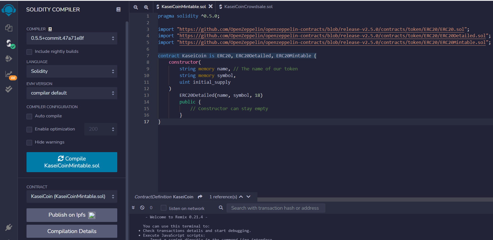

# KaseiCoin_Token_Crowdsale
Create a fungible token that is ERC-20 compliant and that will be minted by using a Crowdsale contract from the OpenZeppelin Solidity library.

---

## Technologies

This project leverages solidity 0.5.0 with the following packages:

**[OpenZeppelin IERC20 Interface](https://github.com/OpenZeppelin/openzeppelin-contracts/blob/release-v2.5.0/contracts/token/ERC20/ERC20.sol)** - Implementation of the {IERC20} interface.

**[OpenZeppelin ERC20 Detailed](https://github.com/OpenZeppelin/openzeppelin-contracts/blob/release-v2.5.0/contracts/token/ERC20/ERC20Detailed.sol)** - Optional functions from the ERC20 standard

**[OpenZeppelin ERC20 Mintable](https://github.com/OpenZeppelin/openzeppelin-contracts/blob/release-v2.5.0/contracts/token/ERC20/ERC20Mintable.sol)** - Extension of {ERC20} that adds a set of accounts with the {MinterRole}, which have permission to mint (create) new tokens as they see fit

**[OpenZeppelin Crowdsale Contract](https://github.com/OpenZeppelin/openzeppelin-contracts/blob/release-v2.5.0/contracts/crowdsale/Crowdsale.sol)** - Crowdsale is a base contract for managing a token crowdsale, allowing investors to purchase tokens with ether. This contract implements such functionality in its most fundamental form and can be extended to provide additional functionality and/or custom behavior

**[OpenZeppelin Minted Crowdsale Contract](https://github.com/OpenZeppelin/openzeppelin-contracts/blob/release-v2.5.0/contracts/crowdsale/emission/MintedCrowdsale.sol)** - Extension of Crowdsale contract whose tokens are minted in each purchase. Token ownership should be transferred to MintedCrowdsale for minting

---

## Installation Guide

There are 2 applications that should be downloaded to work with this program:

1. Ganache

**[Ganache Test BlockChain](https://trufflesuite.com/ganache/)** - Follow the installation instructions for your Operating System. 

2. Metamask

**[Metamask Digital Wallet](https://metamask.io/)** - Follow the installation instructions for your Operating System.

---

## Usage

To use the 'KaseiCoin Token Crowdsale' application, simply clone the repository and import the code in both the `KaseiCoinMintable.sol` and `KaseiCoinCrowdsale.sol` files into the Remix IDE. 

Step 1: Compile the `KaseiCoin` contract

The green checkmark we see by the Solidity `S` lets us know that we compiled this contract successfully. 

Step 2: Compile the `KaseiCoinCrowdsale` contract

Once again, the green checkmark we see by the Solidity `S` lets us know that we compiled this contract successfully.